# 从零开始的深度学习笔记
## 1.multi-layered perceptron
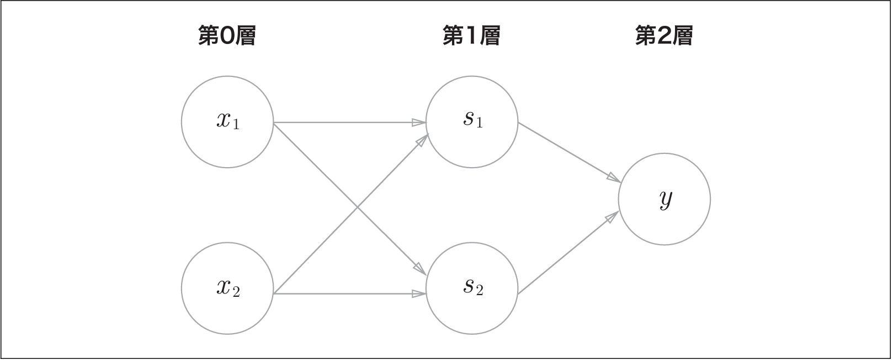
看上去是3层构造，但是实际上只有两层有权重，所以是2层感知机。
## 2.sigmoid function

## 3.sigmoid函数图像

線形関数の問題点は、どんなに層を深くしても、それと同じことを行う「隠れ層のないネットワーク」が必ず存在する、という事実に起因します。
## 4.ReLU函数
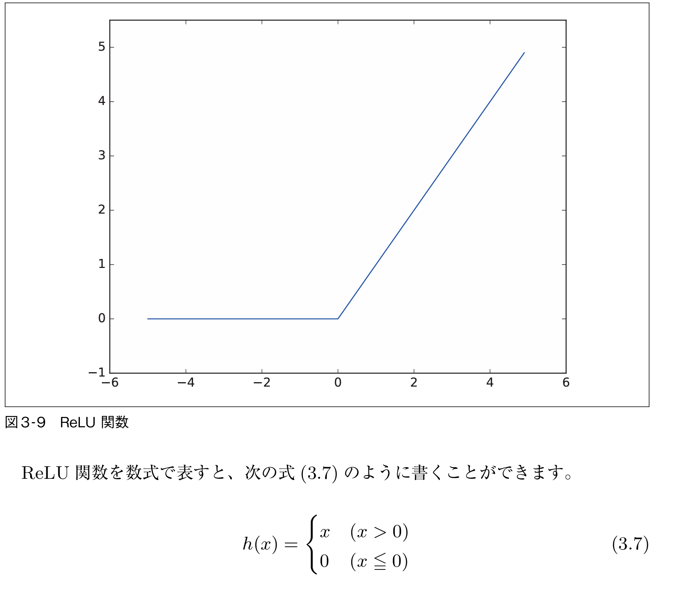
NumPyのmaximumという関数を使っています。このmaximumは、入力された値から大きいほうの値を選んで出力する関数です。
## 5.神经网络

这里需要注意的是，numpy里的1维行列可以看作行，也可以看作列，来进行计算。

**从后神经元往前对应是行列的列，从前神经元往后对应是行列的行**
机器学习中的问题可以大致分类为回归问题和分类问题，回归问题比如说从人物图像中预测这个人的体重等一系列的数值。
**分类问题使用softmax函数**
## 6.softmax函数

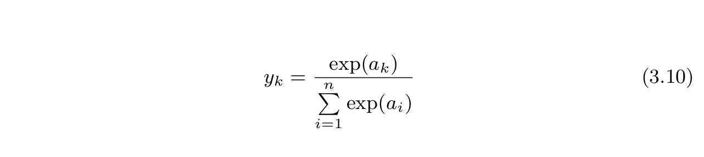

ソフトマックスの指数関数の計算を行う際には、何らかの定数を足し算（もしくは、引き算）しても結果は変わらない、ということです。

**对于输入ak（n个数），加上任意常数，不改变结果**

ここでC′にはどのような値を用いることもできますが、オーバーフローの対策としては、入力信号の中で最大の値を用いることが一般的です。

**一般情况下在模型推论时，会省略softmax函数。那为什么要在输出层使用softmax函数呢？ 原因与模型学习时有关。** 

输出层的个数 = 分类问题中类别的个数

## 7.MNISTデータセット
load_mnist 関数は、「(訓練画像, 訓練ラベル), (テスト画像, テストラベル)」という形式で、読み込んだMNISTデータを返します。また、引数として、load_mnist(normalize=True, flatten=True, one_hot_label=False) のように、3つの引数を設定することができます。
**第一个参数可以把画像的像素通道正则化0到1之间**
normalize をTrue に設定すると、その関数の内部では画像の各ピクセルの値を255で除算し、データの値が0.0～1.0の範囲に収まるように変換されます。このようなデータをある決まった範囲に変換する処理を正規化（normalization）と言います。
**第二个参数可以把画像的1x28x28的三维矩阵化为784的一维矩阵**
**第三个参数可以把图像标签转换为one-hot形式，这个形式可以把2转换成【0，0，1，0，0，0，0，0，0，0】**

**加载这个数据集的时候，要把当前工作目录设置在运行脚本这个目录上，然后使用代码把上一级的目录加入到查找路径中，这样才能正确导入dataset这个文件里的mnist.py**

## 8.批处理
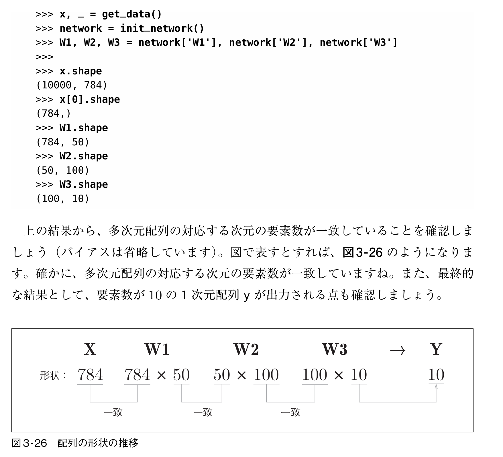
バッチ処理には、コンピュータで計算する上で大きな利点があります。それは、バッチ処理によって、1枚あたりの処理時間を大幅に短縮できるという利点です。なぜ処理時間を短縮できるかというと、値計算を扱うライブラリの多くは、大きな配列の計算を効率良く処理できるような高度な最適化が行われているからです。また、ニューラルネットワークの計算において、データ転送がボトルネックになる場合は、バッチ処理を行うことで、バス帯域の負荷を軽減することができます **（正確には、データの読み込みに対して演算の割合を多くすることができます）**。つまり、バッチ処理を行うことで大きな配列の計算を行うことになりますが、大きな配列を一度に計算するほうが、分割した小さい配列を少しずつ計算するよりも速く計算が完了するのです。

## 9.从数据中学习
そのひとつの方法としては、画像から特徴量を抽出して、その特徴量のパターンを機械学習の技術で学習する方法が考えられます。ここで言う特徴量とは、入力データ（入力画像）から本質的なデータ（重要なデータ）を的確に抽出できるように設計された変換器を指します。
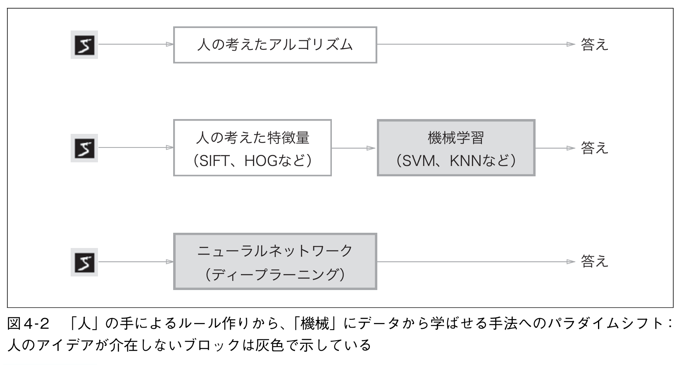

## 10.  2乗和誤差
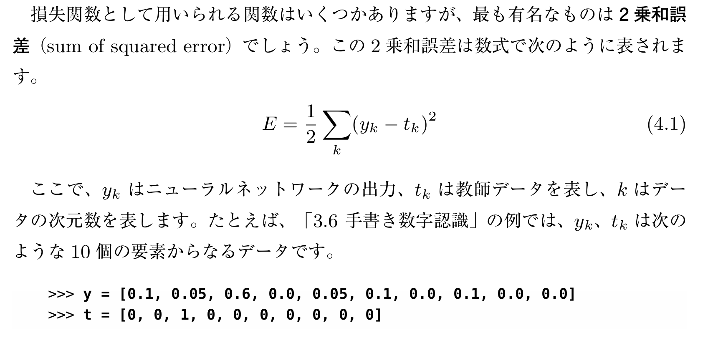
当值偏差大时，损失函数的值也大

## 11.交差エントロピー誤差（cross entropy error）

当值偏差大时，损失函数的值也大

## 12.ミニバッチ学習

n代表数据个数，k代表单个数据的某个值（也等于分类的类别）
除以N之后，相当于是算单个数据的平均损失函数。这样的话损失函数的大小就与训练数据的多少无关了。

**当训练数据过多时，计算总的损失函数会很困难，所以可以分批次计算损失函数，进行模型学习**

在 NumPy 中，当我们用 shape 查看一个数组的形状时，它返回的是一个描述维度的元组。这个元组是对数组的结构描述，而不是数组（矩阵）本身的内容。

模型训练时用小部分数据的损失函数来代替所有数据的损失函数。

## 13.之所以使用损失函数作为指标，而不使用识别精度作为指标的原因
認識精度を指標にしてはいけない理由は、微分がほとんどの場所で0になってしまい、パラメータの更新ができなくなってしまうからなのです。

## 14. 数値微分
丸め誤差：np.float32()会把小数点45位以后的数省略。
需注意数值精度和因为h无法无限趋近于零导致的误差

## 15.勾配法（gradient method）

ηは更新の量を表します。学習率（learning rate）

ニューラルネットワークの学習においては、学習率の値を変更しながら、正しく学習できているかどうか、確認作業を行うのが一般的です。

学習率が大きすぎると、大きな値へと発散してしまいます。逆に、学習率が小さすぎると、ほとんど更新されずに終わってしまいます。つまりは、適切な学習率を設定するということが重要な問題になるということです。

学習率のようなパラメータはハイパーパラメータと言います。一般的には、このハイパーパラメータをいろいろな値で試しながら、うまく学習できるケースを探すという作業が必要になります。

## 16.ニューラルネットワークの学習手順
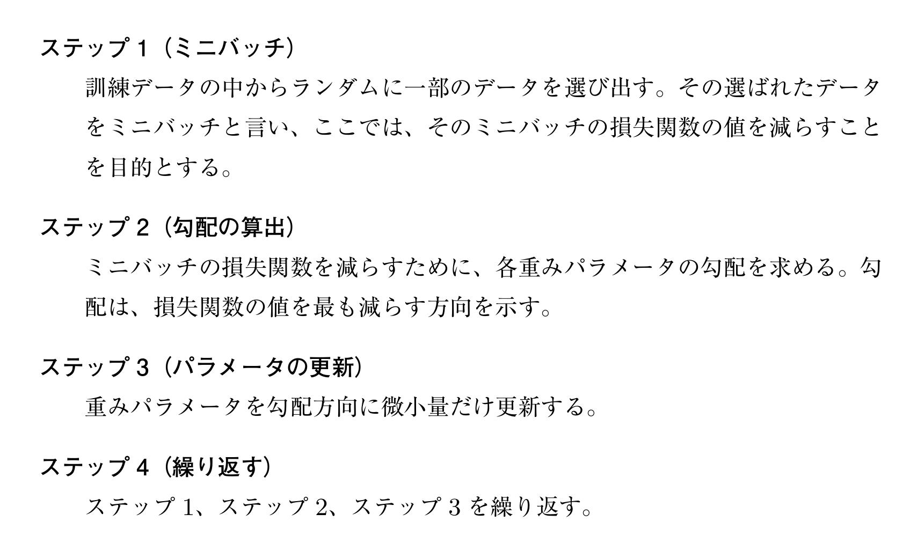

この方法は、勾配降下法によってパラメータを更新する方法ですが、ここで使用するデータはミニバッチとして無作為に選ばれたデータを使用していることから、確率的勾配降下法（stochastic gradient descent）という名前で呼ばれます。SGD

## 17. テストデータで評価
エポック（epoch）とは単位を表します。1エポックとは学習において訓練データをすべて使い切ったときの回数に対応します。たとえば、10,000個の訓練データに対して100個のミニバッチで学習する場合、確率的勾配降下法を100 回繰り返したら、すべての訓練データを“見た”ことになります。この場合、100回＝1エポックとなります。

## 18. なぜ計算グラフで解くのか？
計算グラフを使う最大の理由は、逆方向の伝播によって「微分」を効率良く計算できる点にあるのです。

## 19. 計算グラフの逆伝播

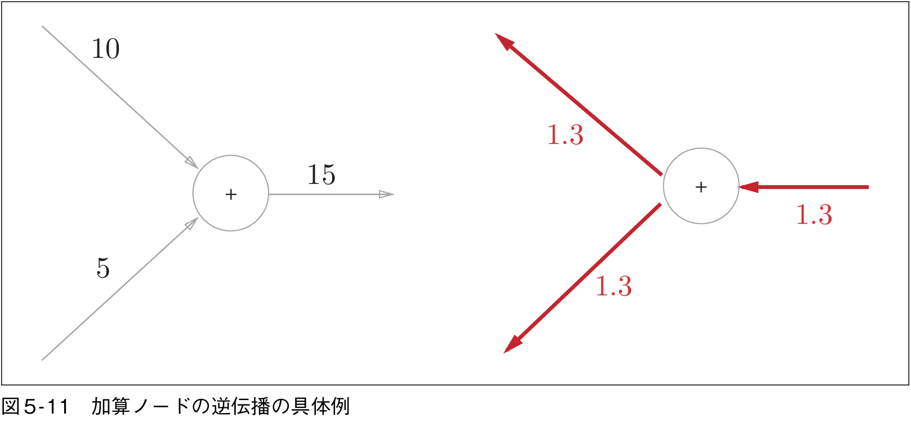

乗算の逆伝播では、順伝播のときの入力信号の値が必要になります。そのため、乗算ノードの実装時には、順伝播の入力信号を保持します。

## 20. ReLUレイヤ

ReLUレイヤは、回路における「スイッチ」のように機能します。順伝播時に電流が流れていればスイッチをONにし、電流が流れなければスイッチをOFFにします。逆伝播時には、スイッチがONであれば電流がそのまま流れ、OFFであればそれ以上電流は流れません。

## 21. Sigmoidレイヤ
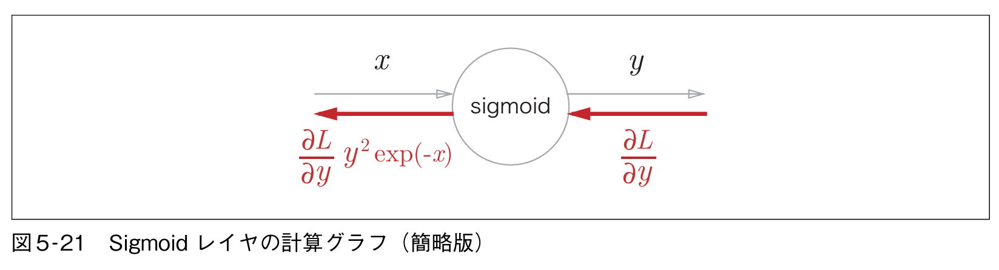

## 22. Affineレイヤ
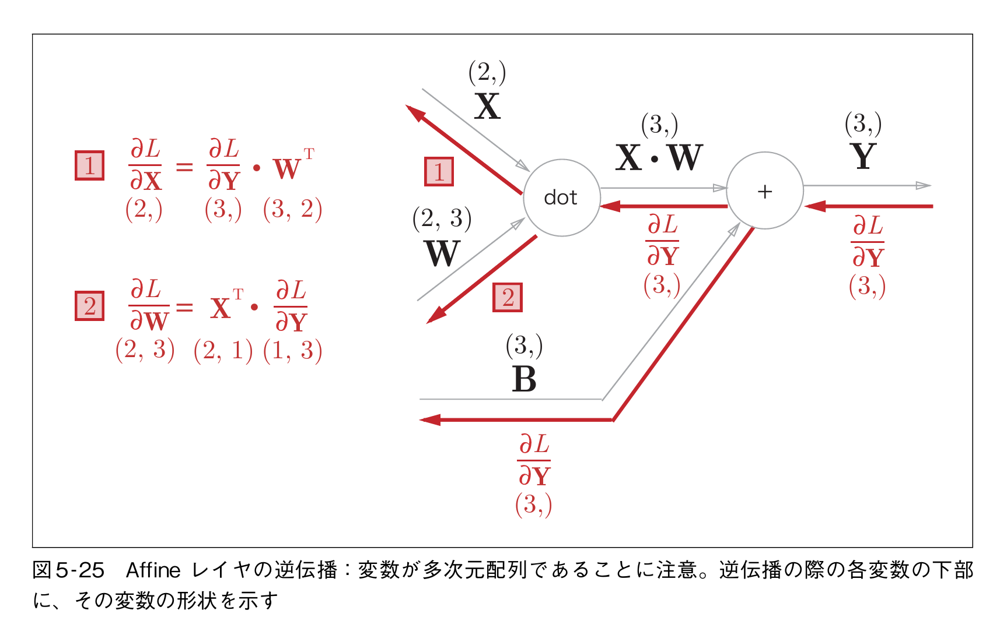

求1的值，应该用传递过来的微分值乘上另一边的w，考虑到矩阵乘法规则对w进行转置。
注意X和dX的矩阵形状是一致的，X是任意位置的矩阵。

## 23. バッチ版Affineレイヤ

无论有几个数据，w的倒数矩阵都是恒定不变的。但是有几个数据，b就有几行，最后需要把b的导数矩阵进行行求和，得到单独的一行数据，对应b的每一个参数的导数。

## 24. Softmax-with-Lossレイヤ
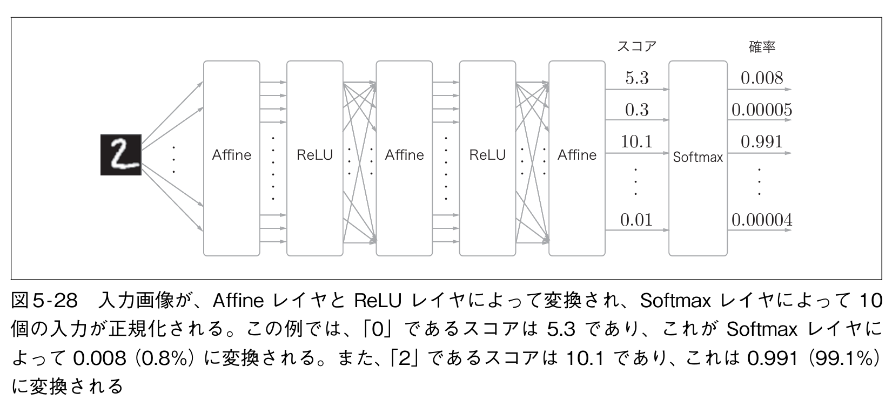
神经网络学习时需要用到softmax函数，但是推论时不需要softmax函数，只需要考虑スコア的最大值。

「ソフトマックス関数」の損失関数として「交差エントロピー誤差」を用いると、逆伝播が(y1 −t1,y2 −t2,y3 −t3) という“キレイ”な結果になりました。実は、そのような“キレイ”な結果は偶然ではなく、そうなるように交差エントロピー誤差という関数が設計されたのです。

また、回帰問題では出力層に「恒等関数」を用い、損失関数として「2乗和誤差」を用いますが（「3.5出力層の設計」参照）、これも同様の理由によります。つまり、「恒等関数」の損失関数として「2乗和誤差」を用いると、逆伝播が(y1−t1,y2−t2,y3−t3)という“キレイ”な結果になるのです。

## 25.勾配確認
数値微分と誤差逆伝播法の結果を比較することで、誤差逆伝播法の実装に誤りがないことを確認できる

## 26.SGDの欠点

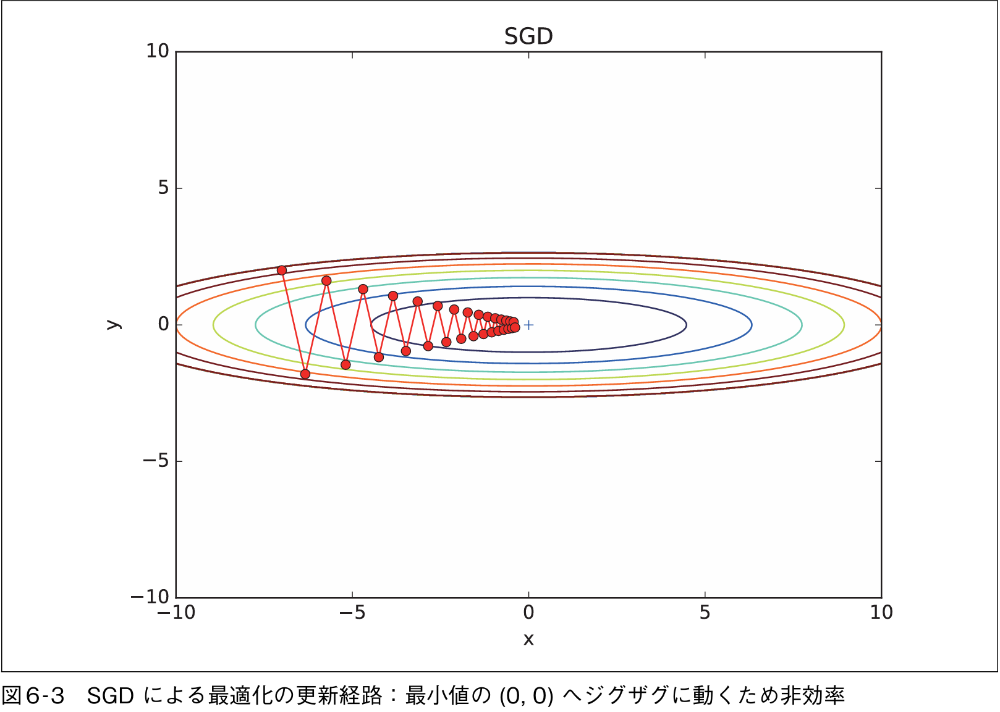
つまり、SGDの欠点は、関数の形状が等方的でないと――伸びた形の関数だと――、非効率な経路で探索ることになる点にあるのです。そこで、SGDで行ったような、単に勾配方向へ進むよりも、もっとスマートな方法が求められるのです。なお、SGDの非効率な探索経路の根本的な原因は、勾配の方向が本来の最小値ではない方向を指していることに起因します。

このSGDの欠点を改善するため、続いて、SGDに代わる手法として、Momentum、AdaGrad、Adam という3つ手法を紹介します。

## 27. Momentum

## 28. AdaGrad
この学習係数に関する有効なテクニックとして、学習係数の減衰（learning rate decay）という方法があります。これは、学習が進むにつれて学習係数を小さくするという方法です。

⊙は行列の要素ごとの掛け算を意味します.做个平方再开根可以保证一直为正数，能够体现参数是否经常大幅度变动。

そのため、学習を進めれば進めるほど、更新度合いは小さくなります。実際のところ、無限に学習を行ったとすると、更新量は0になり、まったく更新されません。この問題を改善した手法として、RMSProp [7] という方法があります。RMSPropという手法は、過去のすべての勾配を均一に加算していくのではなく、過去の勾配を徐々に忘れて、新しい勾配の情報が大きく反映されるように加算します。専門的には「指数移動平均」と言って、指数関数的に過去の勾配のスケールを減少させます。

## 29.Adam
その2つの手法――MomentumとAdaGrad――を融合するとどうなるでしょうか？それがAdam[8] という手法のベースとなるアイデアです

## 30. 重みの初期値
权重不能为0或者相同的数

当使用标准偏差为1的随机初始权重时
ここで使用しているシグモイド関数は、S字カーブの関数ですが、シグモイド関数の出力が0に近づくにつれて（または1に近づくにつれて）、その微分の値は0に近づきます。そのため、0と1に偏ったデータ分布では、逆伝播での勾配の値がどんどん小さくなって消えてしまいます。これは勾配消失（gradient vanishing）と呼ばれる問題です。層を深くするディープラーニングでは、勾配消失はさらに深刻な問題になりえます。

标准偏差大的意味着数据分布更分散，原理均值的数较多

当使用标准偏差为0.01的初始权重时
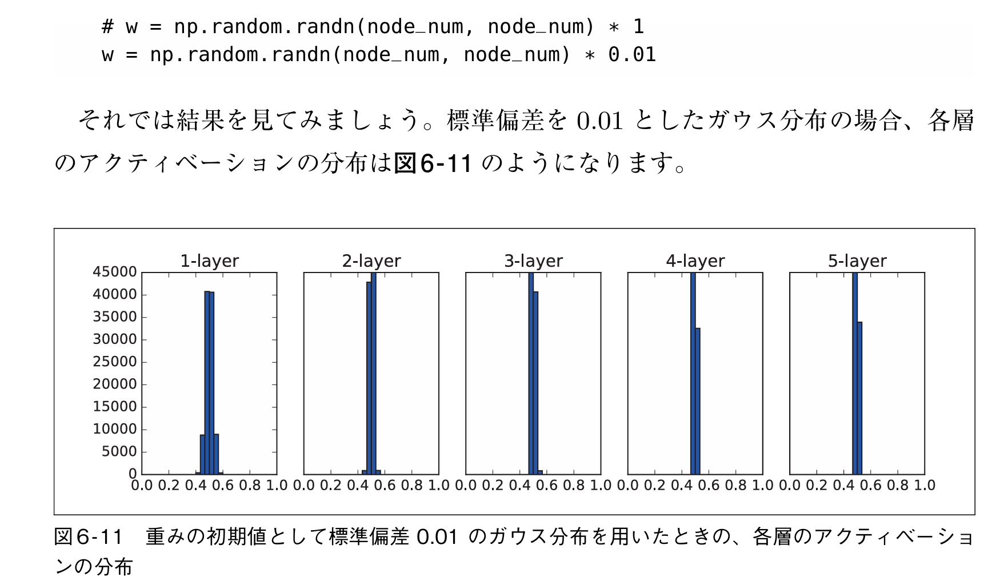
这样数据就不会偏向0或1，这样就不会出愿梯度消失的问题了。
但是激活函数的输出偏向于一个值还是会有问题，这会导致神经元复数存在没有意义了，会限制神经网络的表现力。

各層のアクティベーションの分布は、適度な広がりを持つことが求められます。なぜなら、適度に多様性のあるデータが各層を流れることで、ニューラルネットワークの学習が効率的に行えるからです。逆に、偏ったデータが流れると、勾配消失や「表現力の制限」が問題になって、学習がうまくいかない場合があります。

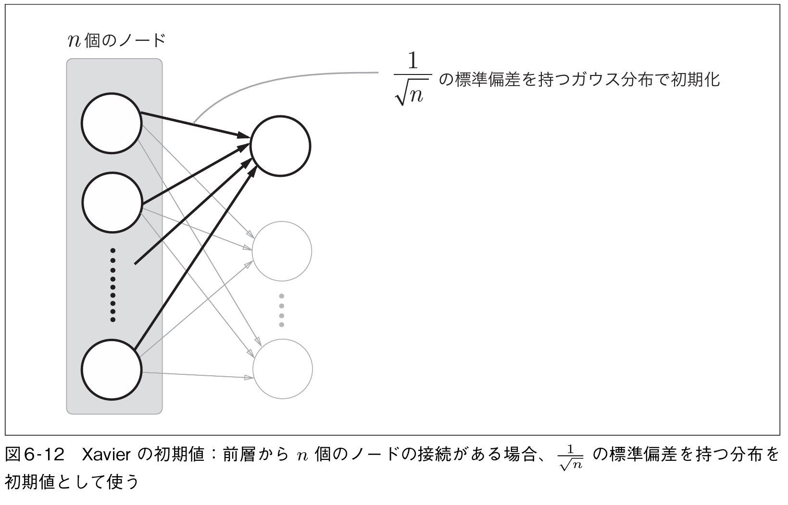

Xavierの权重初期値:
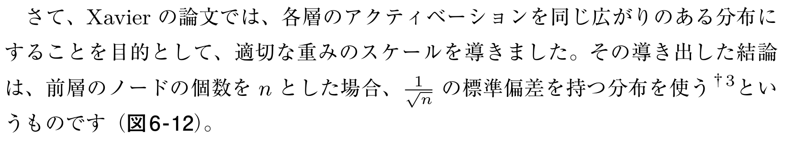

ReLU作为激活函数时推荐使用Heの初期値

总之最重要的是每一层的激活函数输出值要分布均匀。

以上のまとめとしては、活性化関数にReLUを使う場合は「Heの初期値」、sigmoidやtanh などのS字カーブのときは「Xavierの初期値」を使う――これが現時点でのベストプラクティスということになります。

## 31. Batch Normalization
使数据平均值为0，偏差为1
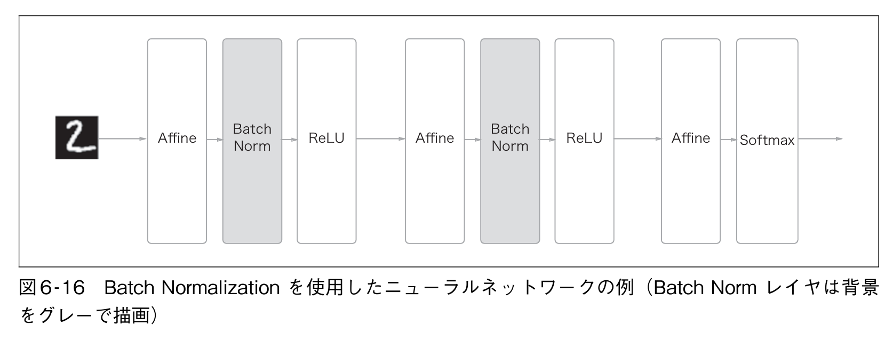
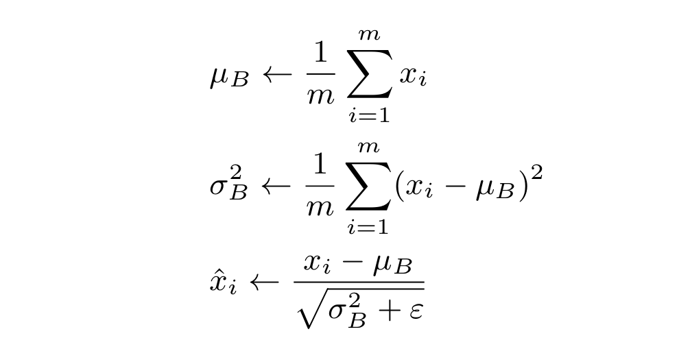

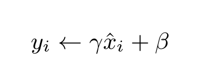
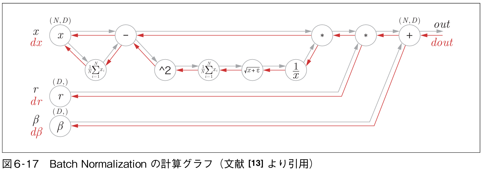
对每一行的元素单独乘以y再加上b
可以使神经网络不那么依赖初期权重的设定。

## 32.过学习
训练数据太少的同时，神经网络也很复杂，这会引起过学习。

過学習抑制のために昔からよく用いられる手法に、Weightdecay（荷重減衰）という手法があります。

## 33. Dropout
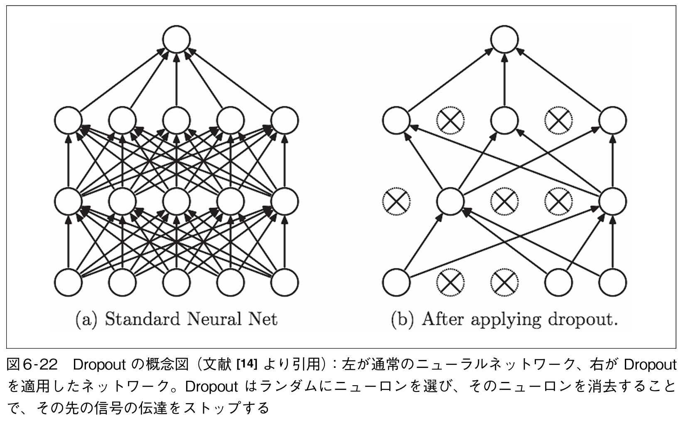

## 34. 検証データ
探索最合适的超参数。

これからハイパーパラメータをさまざまな値に設定して検証していきますが、ここで注意すべき点は、テストデータを使ってハイパーパラメータの性能を評価してはいけない、ということです。

ハイパーパラメータの最適化において、より洗練された手法を求めるとすれば、ベイズ最適化（Bayesian optimization）が挙げられるでしょう。ベイズ最適化は、ベイズの定理を中心とした数学（理論）を駆使して、より厳密に効率良く最適化を行います。詳しくは、論文「Practical Bayesian Optimization of Machine Learning Algorithms」[16] などを参照してください。

通过训练数据和验证数据的准确度来调整超参数的范围，不适用测试数据。

## 35. 畳み込みニューラルネットワーク（convolutional neural network：CNN）
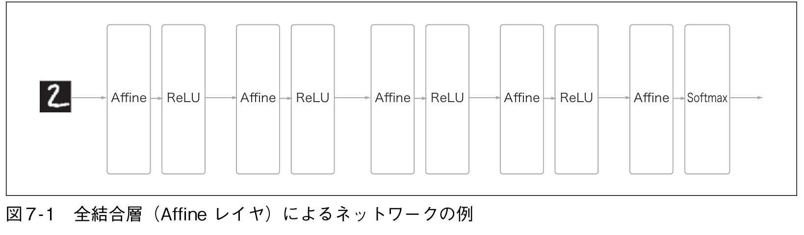

## 36. 畳み込み演算

## 37. パディング（padding）

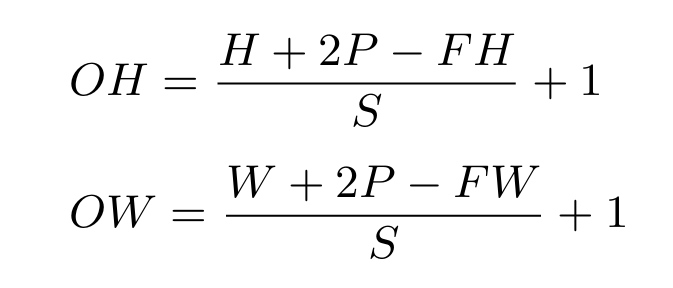

ストライド是指フィルター的跳转间隔

## 38. 3次元データの畳み込み演算

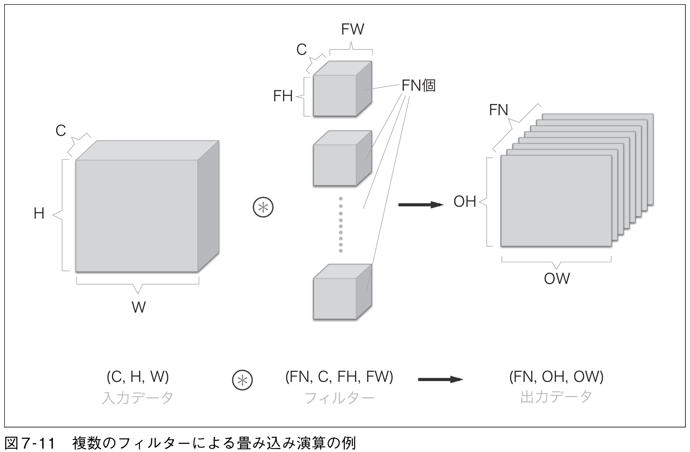

ここでの注意点としては、ネットワークには4次元のデータが流れますが、これは、N個のデータに対して畳み込み演算が行われている、ということです。つまり、N回分の処理を1回にまとめて行っているのです。

## 39. プーリング層
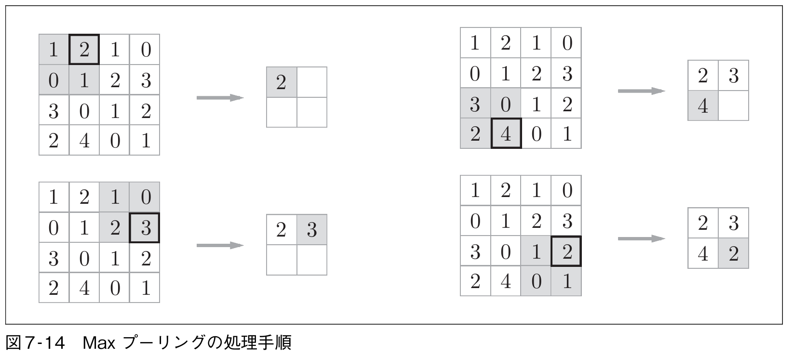
这个运算能减小空间大小
一般的に、プーリングのウィンドウサイズと、ストライドは同じ値に設定します

池化层的特征
1.没有参数
2.输入数据和输出数据的通道数不改变
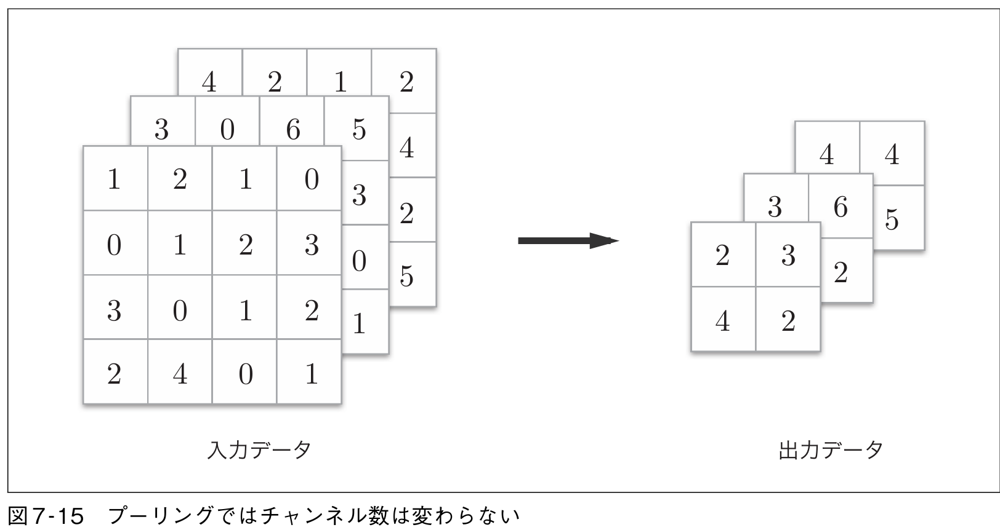
3.对于输入数据的微小误差有时可以消除

## 40. Convolution／Poolingレイヤの実装

### （1）im2colによる展開
能把四次元的数据展开成二次元的数据

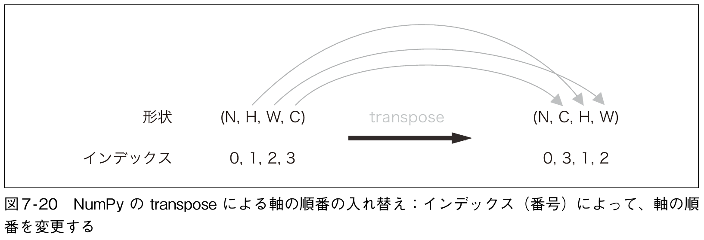

### （2）Poolingレイヤ

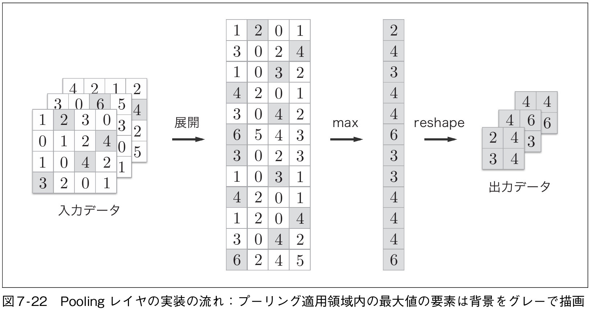